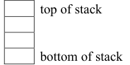
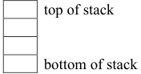
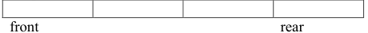
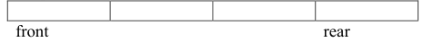

1. Suppose the following operations were performed on an empty stack:
   push(0);
   push(9);
   push(12);
   push(1);
   Insert numbers in the following diagram to show what will be stored in the static stack after the operations have executed.
   

2. Suppose the following operations were performed on an empty stack:
   push(8);
   push(7);
   pop();
   push(19);
   push(21);
   pop();
   Insert numbers in the following diagram to show what will be stored in the static stack after the operations have executed.
   

3. Suppose the following operations are performed on an empty queue:
   enqueue(5);
   enqueue(7);
   enqueue(9);
   enqueue(12);
   Insert numbers in the following diagram to show what will be stored in the static queue after the operations have executed.
   

4. Suppose the following operations are performed on an empty queue:
   enqueue(5);
   enqueue(7);
   dequeue();
   enqueue(9);
   enqueue(12);
   dequeue();
   enqueue(10);
   Insert numbers in the following diagram to show what will be stored in the static queue after the operations have executed.
   
